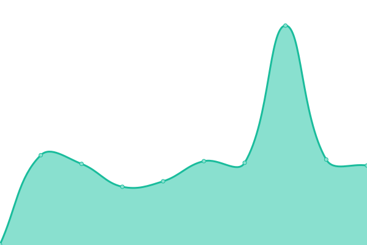

# [📈 Live Status](https://registry-mirrors.top): <!--live status--> **🟧 Partial outage**

This repository contains the open-source uptime monitor and status page for [VoroninaYanina](https://registry-mirrors.top), powered by [Upptime](https://github.com/upptime/upptime).

With [Upptime](https://upptime.js.org), you can get your own unlimited and free uptime monitor and status page, powered entirely by a GitHub repository. We use [Issues](https://github.com/VoroninaYanina/upptime/issues) as incident reports, [Actions](https://github.com/VoroninaYanina/upptime/actions) as uptime monitors, and [Pages](https://registry-mirrors.top) for the status page.

<!--start: status pages-->
<!-- This summary is generated by Upptime (https://github.com/upptime/upptime) -->
<!-- Do not edit this manually, your changes will be overwritten -->
<!-- prettier-ignore -->
| URL | Status | History | Response Time | Uptime |
| --- | ------ | ------- | ------------- | ------ |
|  [hub.registry-mirrors.top](https://hub.registry-mirrors.top) | 🟩 Up | [hub-registry-mirrors-top.yml](https://github.com/VoroninaYanina/status/commits/HEAD/history/hub-registry-mirrors-top.yml) | 

 449ms
     
 | 

<a href="https://registry-mirrors.top/history/hub-registry-mirrors-top">99.36%</a>
    

|  [docker.mybacc.com](https://docker.mybacc.com) | 🟩 Up | [docker-mybacc-com.yml](https://github.com/VoroninaYanina/status/commits/HEAD/history/docker-mybacc-com.yml) | 

 165ms
     
 | 

<a href="https://registry-mirrors.top/history/docker-mybacc-com">100.00%</a>
    

|  [docker.zhai.cm](https://docker.zhai.cm) | 🟩 Up | [docker-zhai-cm.yml](https://github.com/VoroninaYanina/status/commits/HEAD/history/docker-zhai-cm.yml) | 

 144ms
     
 | 

<a href="https://registry-mirrors.top/history/docker-zhai-cm">64.01%</a>
    

|  [docker.1ms.run](https://docker.1ms.run) | 🟩 Up | [docker-1ms-run.yml](https://github.com/VoroninaYanina/status/commits/HEAD/history/docker-1ms-run.yml) | 

 3110ms
     
 | 

<a href="https://registry-mirrors.top/history/docker-1ms-run">100.00%</a>
    

|  [dytt.online](https://dytt.online) | 🟩 Up | [dytt-online.yml](https://github.com/VoroninaYanina/status/commits/HEAD/history/dytt-online.yml) | 

 106ms
     
 | 

<a href="https://registry-mirrors.top/history/dytt-online">100.00%</a>
    

|  [func.ink](https://func.ink) | 🟩 Up | [func-ink.yml](https://github.com/VoroninaYanina/status/commits/HEAD/history/func-ink.yml) | 

 244ms
     
 | 

<a href="https://registry-mirrors.top/history/func-ink">100.00%</a>
    

|  [lispy.org](https://lispy.org) | 🟥 Down | [lispy-org.yml](https://github.com/VoroninaYanina/status/commits/HEAD/history/lispy-org.yml) | 

 337ms
     
 | 

<a href="https://registry-mirrors.top/history/lispy-org">100.00%</a>
    

|  [xiaogenban1993.com](https://docker.xiaogenban1993.com) | 🟩 Up | [xiaogenban1993-com.yml](https://github.com/VoroninaYanina/status/commits/HEAD/history/xiaogenban1993-com.yml) | 

 132ms
     
 | 

<a href="https://registry-mirrors.top/history/xiaogenban1993-com">100.00%</a>
    

|  [dockerhub.websoft9.com](https://dockerhub.websoft9.com) | 🟥 Down | [dockerhub-websoft9-com.yml](https://github.com/VoroninaYanina/status/commits/HEAD/history/dockerhub-websoft9-com.yml) | 

 0ms
     
 | 

<a href="https://registry-mirrors.top/history/dockerhub-websoft9-com">0.00%</a>
    

|  [docker.m.daocloud.io](https://docker.m.daocloud.io) | 🟩 Up | [docker-m-daocloud-io.yml](https://github.com/VoroninaYanina/status/commits/HEAD/history/docker-m-daocloud-io.yml) | 

 1280ms
     
 | 

<a href="https://registry-mirrors.top/history/docker-m-daocloud-io">100.00%</a>
    

|  [hub.xdark.top](https://hub.xdark.top) | 🟩 Up | [hub-xdark-top.yml](https://github.com/VoroninaYanina/status/commits/HEAD/history/hub-xdark-top.yml) | 

 872ms
     
 | 

<a href="https://registry-mirrors.top/history/hub-xdark-top">100.00%</a>
    

|  [dockerhub.timeweb.cloud](https://dockerhub.timeweb.cloud) | 🟩 Up | [dockerhub-timeweb-cloud.yml](https://github.com/VoroninaYanina/status/commits/HEAD/history/dockerhub-timeweb-cloud.yml) | 

 812ms
     
 | 

<a href="https://registry-mirrors.top/history/dockerhub-timeweb-cloud">98.10%</a>
    

|  [dislabaiot.xyz](https://dislabaiot.xyz) | 🟩 Up | [dislabaiot-xyz.yml](https://github.com/VoroninaYanina/status/commits/HEAD/history/dislabaiot-xyz.yml) | 

 130ms
     
 | 

<a href="https://registry-mirrors.top/history/dislabaiot-xyz">100.00%</a>
    

|  [dockerproxy.com](https://dockerproxy.com) | 🟩 Up | [dockerproxy-com.yml](https://github.com/VoroninaYanina/status/commits/HEAD/history/dockerproxy-com.yml) | 

 2302ms
     
 | 

<a href="https://registry-mirrors.top/history/dockerproxy-com">99.05%</a>
    

|  [docker.fxxk.dedyn.io](https://docker.fxxk.dedyn.io) | 🟥 Down | [docker-fxxk-dedyn-io.yml](https://github.com/VoroninaYanina/status/commits/HEAD/history/docker-fxxk-dedyn-io.yml) | 

 412ms
     
 | 

<a href="https://registry-mirrors.top/history/docker-fxxk-dedyn-io">0.96%</a>
    

<!--end: status pages-->

[**Visit our status website →**](https://registry-mirrors.top)

## 📄 License

- Powered by: [Upptime](https://github.com/upptime/upptime)
- Code: [MIT](./LICENSE) © [Anand Chowdhary](https://anandchowdhary.com), supported by [Pabio](https://pabio.com)
- Data in the `./history` directory: [Open Database License](https://opendatacommons.org/licenses/odbl/1-0/)
